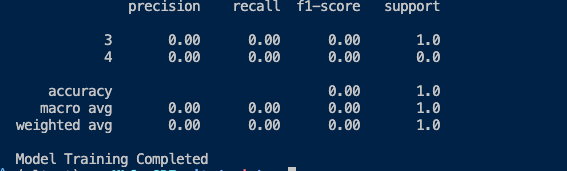

## Readme

POC for ML training for IT Operations

## Objective

The goal of this project is to build a machine learning classifier that can categorise IT operations tickets based on historical incident data. 

The model will be trained on curated, tagged data and evaluated using [Scikit-Learn](https://scikit-learn.org/stable/) which is ML algorithm written in Python. 


## High Level Approach

1. Data Collection & Preprocessing (For this project we create dummy data (IT operations)) [`dataprocess.py`](dataprocess.py)
   *  For simplicity, created a incident file (incidents.csv), Description and Category
   *  Using Pandas to load the csv into a table, seems to be a popular choice for Data folks. It's also called Pandas Dataframe
   * `Machine learning models only understand numbers.` and I m converting `Category` field into numbers, this process is also called (Label Encoding). There is only 1 label field in a simple dataset like this. 
   Example below
```
description                     category              label

Server is down                  System Issue             1

Cannot connect to WiFi          Network Issue            0

Application keeps crashing      Application Issue        2
```
  * Next step is to split the dataset into training set (80%) and testing data (20%). This is to check if the model is accurate or not. [more here](https://scikit-learn.org/stable/modules/generated/sklearn.model_selection.train_test_split.html). If we push all the data into the model, it will just memorise it, testing model is used to quiz the model. 
  * Next step is to comvert incident Description into a numerical format, and uses TF-IDF (Term Frequency-Inverse Document Frequency) to find important words. After conversion, it could be in a vector format `[0.2, 0.5, 0.1, 0.0, ...]` Common words like is, are get lower score wheras words like server, database gets higher score. [more here](https://scikit-learn.org/stable/modules/generated/sklearn.feature_extraction.text.TfidfVectorizer.html)
  * Lastly, we save the data in `pkl` format so that we don't have to process the data everytime. 
  * Vectorizer.pkl is used to convert text to numbers, this is needed to tranform new text when making prediction later. 
  * Processes_data.pkl stores converted training/test data to avoid re-processing every time.  

2. Training model [`trainmodel.py`](trainmodel.py)
* After the data has been processed, we have `incident descriptions`, converted into `TD-IDF vectors`. We also have corresponding labels, we now need to train a model so that it can learn patterns and predict the category of any new incidents.
* In the first step, we load vectorizer as well as the numerical dataset which contains the following: 
- X_train_tfidf -> Training data
- X_test_tfidf -> Testing data
- y_train -> Training labels
- y_test -> Testing labels
* We then initialise Naive Bayes model, and train the model with `model.fit(X_train_tfidf, y_train)` [more about the model](https://scikit-learn.org/stable/modules/generated/sklearn.naive_bayes.MultinomialNB.html)
* Next step is to use the trained model to predict the category for `X_test_tfidf` (Note that this is done on test data)
* It compares predicitons (y_pred) with actual labels (y_test)
* It might print precisions, recalls, F1-score [more here](https://scikit-learn.org/stable/modules/generated/sklearn.metrics.classification_report.html)
* We then save the trained model as `classifier.pkl` so that we don't have to train it again. This is used to predict categories for new incident tickets.
* This was the outcome after training the model 

* What they mean ?
- precision: How many predicted categories were correct ?
- recall: How many categories were predicted correctly ? 
- F1-score: A balance between precision & recall. 

3. Testing model [`testmodel.py`](testmodel.py)

* In this case, I wanted to manually test the model to check how it works. 
* First step is to load the model and vectorizer
* I defined category mapping based on the source input file
* Tested the model, with a text, I delibaretly used the term `Computer` here to check what it can predict. 
* I then got the label, and mapped it to my category. 
* This is the output I got, which was expected, it is a server issue for sure.
* 

## Things to consider/next steps

* Deployment: FastAPI, Flask, Docker (optional)
* LLMs vs Traditional ML: If the dataset is large, LLMs can enhance contextual understanding.

